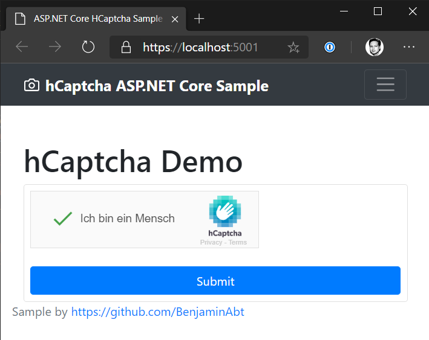

# hCaptcha for .NET

This project is **not** official by hCaptcha.com.

||HCaptcha|HCaptcha.AspNetCore|
|-|-|-|
|NuGet|[](https://www.nuget.org/packages/HCaptcha/)|[](https://www.nuget.org/packages/HCaptcha.AspNetCore/)|
License|[](LICENSE)|[](LICENSE)|
|GitHub Build||

## Dependencies

### Refit
The [HCaptcha.AspNetCore](src/HCaptcha.AspNetCore) project contains the interface [IHCaptchaApi](HCaptcha.AspNetCore/IHCaptchaApi.cs) for use with [Refit](https://github.com/reactiveui/refit).
Refit is an open source project for type-safe handling of REST endpoints, as provided by hCaptcha.com.

If you can't or don't want to use Refit, you can create your own implementation of `IHCaptchaApi` or see usage of hCaptcha without this project.


## Usage with ASP.NET Core

### 1) Options

The configuration is represented via the [HCaptchaOptions](src/HCaptcha/HCaptchaOptions.cs) class. Some values are setwith the current default values of hCaptcha.com.
SiteKey and Secret must be inserted.

The easiest way is to use the .NET Core Configuration via the [appsettings.json](sample/sample.aspnetcore/appsettings.json)
```json
"HCaptcha": {
   "SiteKey": "", // Overwrite them with yours
   "Secret": "" // Overwrite them with yours
}
```
and the registration via `AddHCaptcha`, which is part of [HCaptcha.AspNetCore](src/HCaptcha.AspNetCore).
```csharp
public void ConfigureServices(IServiceCollection services)
{
   // HCaptcha
   services.AddHCaptcha(Configuration.GetSection("HCaptcha"));
   ...
```

### 2) Model Binder Registration

Currently the ASP.NET core library offers an automatism for the integration of HCaptcha.
For this purpose a ModelBinder is used, which is applied as soon as the type `HCaptchaVerifyResponse` is part of the action.

You have to register the Model Binder.

```csharp
public void ConfigureServices(IServiceCollection services)
{
    // HCaptcha
    services.AddHCaptcha(Configuration.GetSection("HCaptcha"));

    // Mvc
    services.AddControllersWithViews(mvcOptions =>
        // add model binder
        mvcOptions.AddHCaptchaModelBinder());
}
```
And your Action:

```csharp
public class HomeController : Controller
{
    [HttpGet, Route("")]
    public IActionResult Index()
    {
        return View(new IndexViewModel());
    }

    [HttpPost, Route("")]
    public IActionResult Index(HCaptchaVerifyResponse hCaptcha)
    {
        return View(new IndexViewModel(hCaptcha));
    }
}
```

Alternatively, the ModelBinder can be specified directly in the action.

```csharp
public class HomeController : Controller
{
    [HttpPost, Route("")]
    public IActionResult Index([ModelBinder(BinderType = typeof(HCaptchaModelBinder))]HCaptchaVerifyResponse hCaptcha)
    {
        return View(new IndexViewModel(hCaptcha));
    }
}
```

It would also be possible to solve the whole automatism via a [ServiceFilter](https://docs.microsoft.com/en-us/aspnet/core/mvc/controllers/filters?view=aspnetcore-3.1#dependency-injection) instead of via the ModelBinder.

## Sample

An ASP.NET Core 3.1 example can be found in the [sample directory](sample).
You only have to add the `SiteKey` and the `Secret` to [appsettings.json](sample/sample.aspnetcore/appsettings.json).



# Use hCaptcha without this project

If you don't want to use this project to request the hCaptcha.com API, you can do so with standard .NET functionality.

## HttpClient

> HttpClient is intended to be instantiated once per application! \
> See [HttpClient documentation](https://docs.microsoft.com/en-us/dotnet/api/system.net.http.httpclient?view=netframework-4.8).

```csharp
private static readonly HttpClient HttpClient = new HttpClient();
public async Task Verify(string secret, string token, string remoteIp)
{
    try
    {
        // create post data
        List<KeyValuePair<string, string>> postData = new List<KeyValuePair<string, string>>
        {
            new KeyValuePair<string, string>("secret", secret),
            new KeyValuePair<string, string>("response", token),
            new KeyValuePair<string, string>("remoteip", remoteIp)
        };

        // request api
        HttpResponseMessage response = await HttpClient.PostAsync(
            // hCaptcha wants URL-encoded POST
            "https://hcaptcha.com/siteverify", new FormUrlEncodedContent(postData));

        response.EnsureSuccessStatusCode();
        string responseBody = await response.Content.ReadAsStringAsync();

        Console.WriteLine(responseBody);
    }
    catch (HttpRequestException e)
    {
        Console.WriteLine($"Message : { e.Message}");
    }
}
```

## HttpClientFactory

Register HttpClient
```csharp
// named registration
services.AddHttpClient("hCaptcha", c =>
{
   c.BaseAddress = new Uri("https://hcaptcha.com/");
});
```
Use `IHttpClientFactory` in your class
```csharp
public class YourServiceClass
{
    private readonly IHttpClientFactory _clientFactory;

    public YourServiceClass(IHttpClientFactory clientFactory)
    {
        _clientFactory = clientFactory;
    }

    public async Task<HttpResponseMessage> Verify(string secret, string token, string remoteIp)
    {
        // HttpClient client = _clientFactory.CreateClient(); 
        //    if you dont have a named service registration
        HttpClient client = _clientFactory.CreateClient("hCaptcha");

        // create post data
        List<KeyValuePair<string, string>> postData = new List<KeyValuePair<string, string>>
        {
            new KeyValuePair<string, string>("secret", secret),
            new KeyValuePair<string, string>("response", token),
            new KeyValuePair<string, string>("remoteip", remoteIp)
        };

        // request api
        return await client.PostAsync(
            // base url is given in IHttpClientFactory service registration
            // hCaptcha wants URL-encoded POST
            "/siteverify", new FormUrlEncodedContent(postData));
    }
```

## Donation

Please donate - if possible - to necessary institutions of your choice such as child cancer aid, children's hospices etc.
Thanks!

## License

[MIT License](LICENSE)